# Architecture & Platform Support - convex_flutter

## v3.0.0 Major Update: Web Platform Support 🌐

**convex_flutter** now supports **ALL Flutter platforms** including web! The package intelligently uses different implementations based on the target platform:

- **Web**: Pure Dart implementation (no Rust required)
- **Native** (Android, iOS, macOS, Windows, Linux): FFI + Rust SDK

## Table of Contents
- [Platform Architecture Overview](#platform-architecture-overview)
- [Web Platform Implementation (NEW in v3.0.0)](#web-platform-implementation-new-in-v300)
- [Native Platform Implementation](#native-platform-implementation)
- [Why Rust is Required (Native Only)](#why-rust-is-required-native-only)
- [Who Needs Rust Installed](#who-needs-rust-installed)
- [How the Package Works](#how-the-package-works)
- [Can Rust Dependency Be Removed?](#can-rust-dependency-be-removed)
- [Alternatives & Tradeoffs](#alternatives--tradeoffs)
- [Impact on Developers](#impact-on-developers)
- [Future Possibilities](#future-possibilities)

---

## Platform Architecture Overview

### Multi-Platform Implementation Strategy

The package uses **conditional imports** to select the appropriate implementation at compile time:

```dart
// lib/src/convex_client.dart
import 'impl/convex_client_native.dart'  // FFI + Rust
    if (dart.library.js_interop) 'impl/convex_client_web.dart';  // Pure Dart
```

### Architecture Comparison

| Platform | Implementation | Rust Required | WebSocket Source |
|----------|---------------|---------------|------------------|
| **Web** | Pure Dart | ❌ No | Browser WebSocket API |
| **Android** | FFI + Rust | ✅ Yes (build-time) | Convex Rust SDK |
| **iOS** | FFI + Rust | ✅ Yes (build-time) | Convex Rust SDK |
| **macOS** | FFI + Rust | ✅ Yes (build-time) | Convex Rust SDK |
| **Windows** | FFI + Rust | ✅ Yes (build-time) | Convex Rust SDK |
| **Linux** | FFI + Rust | ✅ Yes (build-time) | Convex Rust SDK |

---

## Web Platform Implementation (NEW in v3.0.0)

### Why Web Needed Different Approach

**Problem**: FFI (Foreign Function Interface) doesn't work on web platform
- Web runs in browser JavaScript sandbox
- Cannot execute native compiled code
- `dart:ffi` is not available on web

**Solution**: Implement Convex WebSocket protocol in pure Dart

### Web Architecture

```
┌─────────────────────────────────────┐
│   Dart Layer (Flutter Web App)      │  ← Your app code
│   - ConvexClient API (same as native)│
│   - Streams, Futures                 │
│   - Flutter-friendly interfaces      │
└──────────────┬──────────────────────┘
               │ Direct Dart calls (no FFI)
┌──────────────▼──────────────────────┐
│   WebConvexClient (Pure Dart)        │  ← Pure Dart implementation
│   - WebSocket management             │
│   - Convex wire protocol             │
│   - State management                 │
│   - Subscription handling            │
└──────────────┬──────────────────────┘
               │ package:web WebSocket API
┌──────────────▼──────────────────────┐
│   Browser WebSocket                  │  ← Browser native API
│   - Real-time WebSocket client       │
│   - Managed by browser               │
│   - No compilation required          │
└─────────────────────────────────────┘
```

### Web Implementation Details

**File**: `lib/src/impl/convex_client_web.dart` (~800 lines of pure Dart)

**Key Features Implemented**:
- ✅ RFC 4122 compliant UUID v4 generation for session IDs
- ✅ Convex WebSocket wire protocol implementation:
  - Connect message with session management
  - ModifyQuerySet with version tracking
  - Mutation/Action/Query execution
  - Transition messages for real-time updates
  - Ping/Pong heartbeat
- ✅ Real-time subscriptions with automatic cleanup
- ✅ Connection state monitoring
- ✅ Automatic reconnection with exponential backoff
- ✅ Authentication token management
- ✅ Error handling and timeout management

**Dependencies (Web Only)**:
```yaml
dependencies:
  web: ^1.0.0    # Browser WebSocket API access
  http: ^1.2.0   # HTTP client for REST fallback (future)
```

**Protocol Messages**:
```dart
// Connect
{
  "type": "Connect",
  "sessionId": "550e8400-e29b-41d4-a716-446655440000",  // RFC 4122 UUID
  "maxObservedTimestamp": null,
  "connectionCount": 1,
  "clientTs": 1704931200000,
  "lastCloseReason": null
}

// ModifyQuerySet (subscribe)
{
  "type": "ModifyQuerySet",
  "baseVersion": 0,
  "newVersion": 1,
  "modifications": [{
    "type": "Add",
    "queryId": 1,
    "udfPath": "messages:list",
    "args": [{}]
  }]
}

// Mutation
{
  "type": "Mutation",
  "requestId": 1,  // u32 integer
  "udfPath": "messages:send",
  "args": [{"body": "Hello"}]
}
```

### Web vs Native API Parity

**100% API Compatibility**: Same public API works on both platforms

```dart
// This exact code works identically on web AND native!
final client = ConvexClient.instance;

// Queries
final result = await client.query('users:list', {});

// Mutations
await client.mutation(name: 'messages:send', args: {'body': 'Hi'});

// Subscriptions
final sub = await client.subscribe(
  name: 'messages:list',
  args: {},
  onUpdate: (data) => print(data),
  onError: (msg, data) => print(msg),
);

// Connection state
client.connectionState.listen((state) => print(state));

// Authentication
await client.setAuth(token: 'jwt-token');
```

---

## Native Platform Implementation

### TL;DR
**Native platforms use FFI (Foreign Function Interface) to wrap the official Convex Rust SDK.** This means the core Convex client logic is written in Rust and compiled to native code, with Dart code calling into it via FFI.

### Technical Explanation

The package architecture involves three layers:

```
┌─────────────────────────────────────┐
│   Dart Layer (Flutter App)          │  ← Your app code
│   - ConvexClient API                 │
│   - Streams, Futures                 │
│   - Flutter-friendly interfaces      │
└──────────────┬──────────────────────┘
               │ FFI Bridge (flutter_rust_bridge)
┌──────────────▼──────────────────────┐
│   Rust Layer (Native Code)           │  ← Compiled Rust
│   - MobileConvexClient               │
│   - WebSocket management             │
│   - State management                 │
└──────────────┬──────────────────────┘
               │ Rust library dependency
┌──────────────▼──────────────────────┐
│   Convex Rust SDK (convex crate)     │  ← Official Convex SDK
│   - Real-time WebSocket client       │
│   - Query/Mutation/Action execution  │
│   - Connection management            │
└─────────────────────────────────────┘
```

### Key Dependencies

**In `pubspec.yaml`:**
```yaml
dependencies:
  flutter_rust_bridge: ^2.11.1  # Dart ↔ Rust FFI bridge
  ffi: ^2.1.3                   # Dart FFI support
```

**In `rust/Cargo.toml`:**
```toml
[dependencies]
convex = { version = "0.9" }           # Official Convex Rust SDK
flutter_rust_bridge = "=2.11.1"        # Bridge codegen
tokio = { version = "1", features = ["full"] }  # Async runtime
```

**Plugin Configuration in `pubspec.yaml`:**
```yaml
flutter:
  plugin:
    platforms:
      android:
        ffiPlugin: true    # ← This marks it as FFI plugin
      ios:
        ffiPlugin: true
      linux:
        ffiPlugin: true
      macos:
        ffiPlugin: true
      windows:
        ffiPlugin: true
```

### Why Use Rust Instead of Pure Dart?

1. **Official SDK**: Convex provides an official Rust SDK with full WebSocket support
2. **Performance**: Native code (compiled Rust) is faster than interpreted Dart for intensive operations
3. **Code Reuse**: Leverage the battle-tested Convex Rust client instead of reimplementing from scratch
4. **Real-time Features**: WebSocket management, connection pooling, and async I/O are built-in
5. **Type Safety**: Rust's strong type system catches errors at compile time
6. **Cross-platform**: Rust compiles to all Flutter platforms (Android, iOS, Windows, macOS, Linux)

---

## Who Needs Rust Installed

### 1. Package Developers (Maintainers) ✅ NEED RUST

**Who**: Anyone modifying the convex_flutter package itself

**Why**: To build and test Rust code changes

**Requirements**:
```bash
# Install Rust toolchain
curl --proto '=https' --tlsv1.2 -sSf https://sh.rustup.rs | sh

# Verify installation
rustc --version
cargo --version

# Platform-specific tools
# Android: NDK (via Android SDK Manager)
# iOS/macOS: Xcode Command Line Tools
# Windows: Visual Studio Build Tools (C++)
# Linux: build-essential, clang, pkg-config
```

### 2. App Developers (Package Users) ⚠️ CURRENTLY NEED RUST

**Who**: Anyone building a Flutter app that depends on `convex_flutter`

**Why**: Flutter's build system compiles the Rust code when building your app

**The Problem**: This is a significant barrier to adoption. Most Flutter developers don't have Rust installed and shouldn't need to.

**What Happens When Building**:
```bash
# When you run:
flutter build apk

# Flutter build system:
1. Detects FFI plugin (ffiPlugin: true)
2. Looks for Rust source in rust/ directory
3. Invokes `cargo build --release` for target platform
4. Compiles Rust code to native library (.so, .dylib, .dll)
5. Bundles native library into app package
6. ❌ FAILS if Rust toolchain not installed
```

**Error Without Rust**:
```
Error: Unable to find cargo in PATH. Rust toolchain is required.
Please install Rust from https://rustup.rs
```

### 3. End Users (App Users) ✅ DON'T NEED RUST

**Who**: People downloading your app from App Store/Play Store

**Why**: The compiled native libraries are bundled in the app package

**What They Get**: Pre-compiled native code (no Rust needed)

---

## How the Package Works

### Build Process

```mermaid
graph TD
    A[flutter build] --> B{Detect FFI Plugin}
    B --> C[Invoke cargo build]
    C --> D[Compile Rust → Native Library]
    D --> E[Bundle .so/.dylib/.dll into app]
    E --> F[App can call Rust via FFI]
```



### Runtime Flow

**Example: Executing a Query**

```dart
// 1. Dart: User calls query
final result = await ConvexClient.instance.query('users:list', {});
```

↓

```dart
// 2. Dart: ConvexClient calls Rust via FFI bridge
final rustResult = await _mobileClient.query(
  name: 'users:list',
  args: '{}',
  timeout: Duration(seconds: 30),
);
```

↓

```rust
// 3. Rust: MobileConvexClient receives call
pub async fn query(&self, name: String, args: String, timeout: Duration) -> Result<String> {
    let client = self.connected_client().await?;  // Get Convex client

    // Parse args, execute query via Convex SDK
    let result = client.query(name, args).await?;

    // Return JSON string to Dart
    Ok(serde_json::to_string(&result)?)
}
```

↓

```rust
// 4. Convex Rust SDK: Execute query
// - Establish WebSocket connection
// - Send query request
// - Receive response
// - Return result
```

↓

```dart
// 5. Dart: Return result to app
return jsonDecode(rustResult);
```

### File Structure

```
convex_flutter/
├── lib/                          # Dart code (Flutter layer)
│   ├── convex_flutter.dart       # Public API
│   └── src/
│       ├── convex_client.dart    # Main client (Dart)
│       ├── rust/                 # Generated FFI bindings
│       │   └── lib.dart          # Auto-generated by flutter_rust_bridge
│       └── *.dart                # Other Dart types/utilities
│
├── rust/                         # Rust code (Native layer)
│   ├── Cargo.toml                # Rust dependencies
│   ├── src/
│   │   ├── lib.rs                # Main Rust implementation (wraps Convex SDK)
│   │   └── frb_generated.rs      # Auto-generated FFI bindings
│   └── target/                   # Compiled Rust artifacts (1.9GB+)
│
├── pubspec.yaml                  # Flutter package config (ffiPlugin: true)
└── README.md                     # Package documentation
```

**Code Statistics**:
- **Dart files**: 33 (UI, API, types)
- **Rust files**: 2 (core client logic)
- **Lines of Rust**: ~800 lines wrapping Convex SDK

---

## Can Rust Dependency Be Removed?

### Short Answer: **Technically YES, but at SIGNIFICANT cost**

### Long Answer: Multiple Approaches, Each with Major Tradeoffs

---

## Alternatives & Tradeoffs

### Option 1: Pure Dart Implementation ❌ NOT RECOMMENDED

**Approach**: Rewrite entire Convex client in Dart

**Pros**:
- ✅ No Rust dependency
- ✅ Easier for Flutter developers to contribute
- ✅ No FFI bridge overhead
- ✅ Single language ecosystem

**Cons**:
- ❌ **MASSIVE development effort** (thousands of lines of code)
- ❌ Reimplementing WebSocket protocol, connection management, state handling
- ❌ Maintaining parity with official Convex SDK features
- ❌ Testing and bug fixes (Rust SDK is battle-tested)
- ❌ Ongoing maintenance burden (keeping up with Convex API changes)
- ❌ Potential performance issues (Dart vs native code)

**Estimated Effort**: 3-6 months of full-time development + ongoing maintenance

**Verdict**: Only viable if Convex provides an official Dart SDK

---

### Option 2: Pre-compiled Native Binaries ⚠️ POSSIBLE BUT COMPLEX

**Approach**: Build Rust code in advance for all platforms, distribute binaries with package

**How It Works**:
```
1. Package maintainer builds Rust code for all targets:
   - Android: arm64-v8a, armeabi-v7a, x86_64, x86
   - iOS: arm64 (device), x86_64 (simulator)
   - macOS: arm64 (Apple Silicon), x86_64 (Intel)
   - Windows: x86_64
   - Linux: x86_64, arm64

2. Include all binaries in package (in android/libs/, ios/, etc.)

3. Flutter build system uses pre-built binaries instead of compiling
```

**Pros**:
- ✅ App developers don't need Rust installed
- ✅ Faster builds (no Rust compilation)
- ✅ Same functionality as current implementation

**Cons**:
- ❌ **Large package size** (~50-100MB for all platforms/architectures)
- ❌ **CI/CD complexity** (must build for 10+ target platforms)
- ❌ **Security concerns** (distributing pre-built binaries)
- ❌ Package maintainer needs all platform build environments
- ❌ pub.dev size limits (10MB for packages, need special approval for larger)
- ❌ Still need Rust for package development

**Package Size Impact**:
```
Current package size: 328 KB (source only)
With pre-compiled binaries: ~80-120 MB (all platforms/architectures)

Breakdown:
- Android (4 architectures): ~20-30 MB
- iOS (2 architectures): ~15-20 MB
- macOS (2 architectures): ~15-20 MB
- Windows: ~10-15 MB
- Linux: ~10-15 MB
```

**Verdict**: Solves developer experience but creates distribution challenges

---

### Option 3: REST API Only (No WebSockets) ❌ LOSES KEY FEATURES

**Approach**: Use Convex HTTP API directly (no WebSockets)

**Pros**:
- ✅ Pure Dart implementation (easy to write)
- ✅ No Rust dependency
- ✅ Simple HTTP client (`package:http`)

**Cons**:
- ❌ **NO real-time subscriptions** (major feature loss)
- ❌ **NO automatic reconnection** on network changes
- ❌ **NO connection state management**
- ❌ Must poll for updates (inefficient, battery drain)
- ❌ Higher latency for real-time features
- ❌ Not using official Convex SDK

**What You Lose**:
```dart
// ❌ Real-time subscriptions (lost)
client.subscribe(
  name: 'messages:list',
  args: {},
  onUpdate: (messages) => print('New messages: $messages'),
);

// ❌ Connection state monitoring (lost)
client.connectionState.listen((state) {
  print('Connection: $state');
});

// ❌ Automatic reconnection (lost)
// ❌ WebSocket efficiency (lost)
```

**Verdict**: Only viable for simple apps without real-time requirements

---

### Option 4: Hybrid Approach ⚠️ BEST COMPROMISE

**Approach**: Offer TWO packages

1. **`convex_flutter`** (current): Full-featured FFI package with Rust
2. **`convex_flutter_lite`** (new): Pure Dart HTTP-only version

**Pros**:
- ✅ Developers choose based on needs
- ✅ Simple apps can avoid Rust dependency
- ✅ Advanced apps get full features
- ✅ Clear upgrade path (lite → full)

**Cons**:
- ❌ Maintain two packages
- ❌ Feature parity issues
- ❌ Documentation duplication
- ❌ Potential confusion for users

**Verdict**: Good middle ground if demand justifies the effort

---

### Option 5: Official Convex Dart SDK 🎯 IDEAL SOLUTION

**Approach**: Ask Convex to provide an official Dart/Flutter SDK

**Pros**:
- ✅ No Rust dependency (if written in Dart)
- ✅ Official support from Convex
- ✅ Feature parity guaranteed
- ✅ Professional maintenance

**Cons**:
- ❌ Outside our control
- ❌ May not happen (Convex prioritizes other platforms)
- ❌ Timeline uncertain

**Action**: Submit feature request to Convex team

**Verdict**: Best long-term solution, but not immediately available

---

## Impact on Developers

### Current Developer Experience (With Rust)

**First-time setup**:
```bash
# 1. Install Rust (5-10 minutes)
curl --proto '=https' --tlsv1.2 -sSf https://sh.rustup.rs | sh
source $HOME/.cargo/env

# 2. Install platform tools
# Android: Install NDK via Android SDK Manager
# iOS/macOS: xcode-select --install
# Windows: Install Visual Studio Build Tools
# Linux: sudo apt-get install build-essential clang pkg-config

# 3. Add package to Flutter project
flutter pub add convex_flutter

# 4. First build (slow - compiles Rust)
flutter run  # Takes 2-5 minutes on first build

# 5. Subsequent builds (faster - uses cache)
flutter run  # Takes 30-60 seconds
```

**Common Issues**:
- ❌ "cargo: command not found" → Rust not installed
- ❌ "NDK not found" → Android NDK missing
- ❌ Long build times (Rust compilation adds 1-3 minutes)
- ❌ Large build artifacts (rust/target/ = 1.9GB)

**Comparison to Pure Dart Packages**:
```bash
# Pure Dart package (e.g., http, provider, riverpod)
flutter pub add http  # Done in 5 seconds
flutter run           # Builds in 30 seconds

# convex_flutter (FFI plugin)
flutter pub add convex_flutter  # Requires Rust setup (10 minutes)
flutter run                      # Builds in 3-5 minutes (first time)
```

---

## Future Possibilities

### 1. Streamlined Rust Installation 🔧

**Idea**: Provide automated setup script

```bash
# Example setup script
curl -sSf https://raw.githubusercontent.com/jkuldev/convex_flutter/main/setup.sh | sh

# Script would:
# 1. Detect OS (macOS, Linux, Windows)
# 2. Install Rust if missing
# 3. Install platform tools (NDK, Xcode, etc.)
# 4. Configure environment
# 5. Run test build
```

**Impact**: Reduces setup friction from 30 minutes to 5 minutes

---

### 2. Pre-compiled Binaries via GitHub Releases 📦

**Idea**: Host pre-compiled binaries separately, download on demand

```yaml
# pubspec.yaml
dependencies:
  convex_flutter: ^2.2.0

# On first build, Flutter plugin downloads pre-built binaries
# from GitHub releases instead of compiling Rust
```

**How**:
1. CI/CD builds binaries for all platforms
2. Binaries uploaded to GitHub Releases
3. Flutter plugin downloads correct binary for target platform
4. Falls back to Rust compilation if download fails

**Impact**:
- ✅ App developers don't need Rust
- ✅ Faster builds
- ❌ Still large downloads (~10-20MB per platform)

---

### 3. Official Convex Dart SDK 🎯

**Ideal Long-term Solution**: Convex provides official Dart/Flutter SDK

**Request to Convex**:
```
Subject: Feature Request - Official Dart/Flutter SDK

Dear Convex Team,

We maintain convex_flutter, a community package wrapping your Rust SDK.
Current architecture requires all Flutter developers to install Rust,
which is a significant adoption barrier.

Would Convex consider providing an official Dart/Flutter SDK?

Benefits:
- Wider Flutter ecosystem adoption
- Better developer experience
- Official support and maintenance
- Feature parity with other platforms (JS, Python, Rust)

Thank you for consideration.
```

---

### 4. WebAssembly (WASM) Compilation 🌐

**Future Tech**: Compile Rust to WASM, run in Dart VM

**Status**: Experimental (Flutter WASM support is evolving)

**Potential**:
- ✅ No Rust toolchain needed
- ✅ Smaller package size
- ✅ Same Rust code
- ❌ Performance overhead (WASM vs native)
- ❌ Flutter WASM support still maturing

---

## Summary & Recommendations

### Current State
- ✅ **Fully functional** with real-time WebSocket support
- ✅ **Production-ready** (v2.2.0)
- ❌ **Requires Rust** for all developers (barrier to adoption)

### Short-term Recommendations

**For Package Maintainers**:
1. **Document Rust requirement clearly** in README (add prominent warning)
2. **Provide setup guide** with troubleshooting
3. **Add FAQ section** explaining why Rust is needed
4. **Consider pre-compiled binaries** for popular platforms (Android/iOS first)

**For App Developers**:
1. **Accept Rust requirement** if you need real-time features
2. **Use alternative packages** if Rust is a dealbreaker (e.g., HTTP-only Convex client)
3. **Submit feedback** about Rust requirement (helps prioritize solutions)

### Long-term Recommendations

1. **Investigate pre-compiled binaries** (GitHub Actions CI/CD)
2. **Create `convex_flutter_lite`** (pure Dart HTTP-only version)
3. **Request official Dart SDK** from Convex team
4. **Monitor Flutter WASM** progress

### Decision Matrix

| Feature | Current (Rust FFI) | Pre-compiled | Pure Dart | HTTP-only |
|---------|-------------------|--------------|-----------|-----------|
| Real-time subscriptions | ✅ | ✅ | ✅ | ❌ |
| Connection state | ✅ | ✅ | ✅ | ❌ |
| No Rust needed | ❌ | ✅ | ✅ | ✅ |
| Small package size | ✅ | ❌ | ✅ | ✅ |
| Easy maintenance | ✅ | ⚠️ | ❌ | ✅ |
| Performance | ✅ | ✅ | ⚠️ | ⚠️ |
| Official SDK parity | ✅ | ✅ | ❌ | ❌ |

---

## FAQ

### Q: Why not just use HTTP requests instead of WebSockets?
**A**: WebSockets provide real-time bidirectional communication. With HTTP, you'd need to poll for updates, which is inefficient, drains battery, and has higher latency. Convex's real-time subscriptions require WebSockets.

### Q: Can I use this package without installing Rust?
**A**: ✅ YES for web platform! No Rust required when building for web. For native platforms (Android, iOS, macOS, Windows, Linux), Rust is still required at build-time. If your app only targets web, you can skip Rust installation entirely.

### Q: Will this work on web platform?
**A**: ✅ YES! As of v3.0.0, web platform is fully supported with a pure Dart implementation. No Rust required for web builds. See [Web Platform Implementation](#web-platform-implementation-new-in-v300) section above.

### Q: How much does Rust compilation add to build time?
**A**: First build: 2-5 minutes. Subsequent builds: 30-60 seconds (cached). Release builds take longer (5-10 minutes).

### Q: Can I distribute my app without users needing Rust?
**A**: Yes! End users don't need Rust. The compiled native libraries are bundled in your app package. Only developers building the app need Rust.

### Q: Is there a roadmap for removing Rust dependency?
**A**: We're investigating pre-compiled binaries for v3.0. Long-term, we hope Convex provides an official Dart SDK. See [Future Possibilities](#future-possibilities) section.

---

## Contributing

If you have ideas for reducing Rust dependency burden:
1. Open an issue: https://github.com/jkuldev/convex_flutter/issues
2. Discuss in PR: https://github.com/jkuldev/convex_flutter/pulls
3. Contact maintainers: https://jkuldev.com

---

**Document Version**: 2.0
**Last Updated**: 2026-01-10
**Package Version**: 3.0.0
